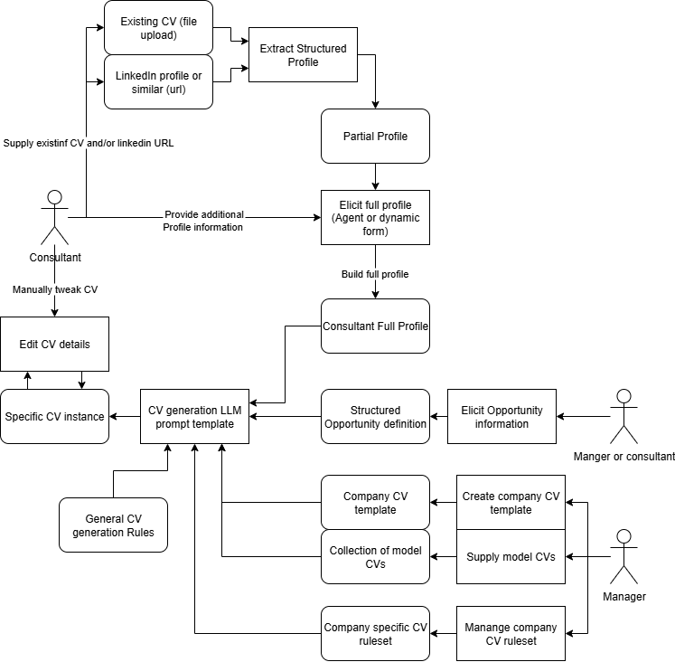

# Concept

An AI-powered CV generator designed for consultancies and professional services firms. It enables companies to produce high-quality, tailored CVs for their consultants, customised per opportunity, per client, and per role, with consistency of branding and format.

---

## Problem

Consultancies regularly need to present consultant CVs tailored to specific clients, roles, and project requirements. This process is typically slow, inconsistent, and dependent on individuals remembering to keep their profiles up to date. The tool addresses this by:

- Maintaining rich, structured consultant profiles that can be built up incrementally
- Allowing CVs to be generated quickly against a specific opportunity, role, and company format
- Enforcing company branding and style through templates and rulesets
- Managing CVs as versioned artefacts that can be forked and iterated

---

## Core Features

### 1. Consultant Profiles
A comprehensive structured profile for each consultant — a superset of any CV they might produce. Profiles are designed to be appended to over time with minimal effort.

- Import an existing CV: paste text or upload a document; an LLM extracts and maps information to the profile schema
- Guided profile builder: prompts for additional information not captured from the imported CV
- Profile sections: personal summary, work experience, education, certifications, skills, projects, publications, languages, references
- Each profile entry is timestamped and can be annotated with context
- Profiles are not CVs — they are the full source of truth from which CVs are selected and generated

### 2. Opportunities
Opportunities represent a pitch, tender, or role a consultancy is pursuing.

- Create an opportunity with: client name, role title, description, requirements, deadline
- Attach guidance notes per consultant (e.g. intended role, emphasis areas)
- Generate CVs for a set of consultants against a single opportunity in one flow
- Track which CV versions were submitted for each opportunity

### 3. CV Templates
Templates define the format and visual appearance of generated CVs. They are not designed from scratch — they are selected from a library and customised with company branding.

- Browse a library of professional CV templates
- Customise with company logo, colours, fonts, and header/footer content
- Templates are stored as HTML/CSS and rendered using the same CDN stack as Blitz (DaisyUI + Tailwind + Alpine.js)
- Templates include named section slots (e.g. `data-slot="summary"`) that the generation step populates

### 4. Rulesets
Rulesets are company-defined generation guidelines that shape how CVs are written and what they include.

- Define rules such as: "always use third person", "limit to 2 pages", "include a skills matrix"
- Rulesets can be applied globally or per template
- Stored as structured JSON and injected into the LLM system prompt at generation time

### 5. CV Generation
Generate a tailored CV for a specific consultant, template, and opportunity.

- **Content selection phase**: Given the consultant profile and the opportunity description, the LLM selects the most relevant experience, skills, and projects. This occurs separately from template population.
- **Template population phase**: The selected content is inserted into the chosen template, applying ruleset constraints.
- Generated CVs are self-contained HTML files — viewable in-browser and exportable as PDF

### 6. CV Version Control
CVs are managed with lightweight version history.

- Each generation creates a new version
- Versions can be compared side-by-side
- A CV version can be "forked" to create a new branch for a different opportunity or role variant
- Versions are tagged with the opportunity and consultant they were generated for

### 7. Export
- **PDF export** is the primary export target — via browser print-to-PDF or a headless renderer
- **Standalone HTML** export for email or web hosting

---

## Architecture Draft



### Inherited from Blitz

The following components are carried over largely unchanged:

| Component | Purpose |
|---|---|
| `lib/utils/canvasManager.ts` | Imperative DOM canvas rendering |
| `lib/utils/storage.ts` | Project persistence (adapted for CV data model) |
| `app/layout.tsx` | CDN stack: DaisyUI CSS + Tailwind Play CDN + Alpine.js |
| `components/editor/Canvas.tsx` | HTML canvas div with selection handling |
| `components/editor/EditPanel.tsx` | Raw HTML/CSS editor for template editing |
| `components/editor/RefinePanel.tsx` | Refinement instruction UI |
| `components/editor/SelectionOverlay.tsx` | Visual selection overlay |
| `components/ui/` | shadcn/ui component library |
| `lib/hooks/useStreamUpdate.ts` | Streaming update hook |
| `lib/ai/models.ts` | AI model provider setup |

### New or Heavily Modified

| Component | Status | Description |
|---|---|---|
| `types/index.ts` | Rewrite | New domain types: `ConsultantProfile`, `Opportunity`, `CVTemplate`, `Ruleset`, `CVVersion`, `Company` |
| `lib/ai/prompts.ts` | Rewrite | CV-specific prompts: profile extraction, content selection, template population |
| `lib/ai/schemas.ts` | Rewrite | Zod schemas for CV generation output |
| `lib/store/` | Major rework | State for profiles, opportunities, templates, rulesets, CV versions |
| `app/` routes | Major rework | Dashboard, profiles, opportunities, templates, rulesets, CV editor |
| `components/editor/GeneratePrompt.tsx` | Replace | CV generation wizard (consultant + opportunity + template selection) |
| `components/editor/TopBar.tsx` | Modify | CV-specific actions: fork, export PDF, version history |
| `components/editor/EditorLayout.tsx` | Modify | Adapt for CV editing workflow |
| `app/api/generate/route.ts` | Rewrite | Two-phase CV generation (content selection + template population) |
| `app/api/refine/route.ts` | Rewrite | CV refinement with ruleset enforcement |
| `lib/utils/storage.ts` | Extend | Persist profiles, opportunities, templates, rulesets, CV versions |
| `lib/templates/` | Replace | CV template library replacing website templates |

### Removed

| Component | Reason |
|---|---|
| `components/editor/SiteTree.tsx` | Website-specific (site header/footer concept) |
| `components/editor/PageList.tsx` | Website pages → replaced by CV sections |
| `components/editor/TemplateWizard.tsx` | Website template wizard → replaced by CV template browser |
| `components/editor/AddSectionDialog.tsx` | Replaced by profile-driven section selection |
| `components/editor/ImageUploadOverlay.tsx` | Not needed for CV generation |
| `components/editor/VideoEditorPanel.tsx` | Not applicable |
| `components/editor/FormEditorPanel.tsx` | Not applicable |
| `app/api/suggest-theme/route.ts` | Website theming → not applicable |
| `app/api/add/route.ts` | Website section adding → not applicable |
| `app/api/suggest/route.ts` | Website suggestions → not applicable |
| `app/p/[slug]/route.ts` | Website publishing → replaced by PDF export |
| Multi-page hash router export | CV is a single document |
| Site-level components (navbar/footer) | Not applicable to CV context |

---

## Implementation Plan

### Phase 1 — Foundation & Data Model

**Goal**: Replace the Blitz data model with CV-specific types and basic persistence.

- [ ] Define new domain types in `types/index.ts`:
  - `Company { id, name, logo, brandColors }`
  - `ConsultantProfile { id, name, headline, sections: ProfileSection[] }`
  - `ProfileSection { id, type, entries: ProfileEntry[] }` (experience, education, skills, etc.)
  - `Opportunity { id, clientName, roleTitle, description, requirements, consultantGuidance: Record<profileId, string> }`
  - `CVTemplate { id, name, category, html, rulesetIds: string[] }`
  - `Ruleset { id, name, rules: string[] }`
  - `CVVersion { id, profileId, templateId, opportunityId, html, createdAt, parentVersionId? }`
- [ ] Update `lib/store/` with a new Zustand store for the CV domain
- [ ] Update `lib/utils/storage.ts` to persist the new data model to localStorage
- [ ] Remove or stub out website-specific API routes

### Phase 2 — Profile Management

**Goal**: Allow creating and populating consultant profiles.

- [ ] Build profile list page (`app/profiles/page.tsx`)
- [ ] Build profile editor (`app/profiles/[id]/page.tsx`) with section-by-section editing
- [ ] Build profile import flow: paste CV text → POST `/api/extract-profile` → LLM maps to profile schema
- [ ] Build profile completion prompts: after import, identify gaps and prompt for missing information
- [ ] Write profile extraction prompt in `lib/ai/prompts.ts`
- [ ] Write profile extraction Zod schema in `lib/ai/schemas.ts`

### Phase 3 — Template Management

**Goal**: Allow browsing, selecting, and customising CV templates.

- [ ] Build a library of 5–10 initial CV templates as HTML/CSS (stored in `lib/templates/`)
- [ ] Build template browser (`app/templates/page.tsx`)
- [ ] Build template editor — reuse Canvas + EditPanel from Blitz
- [ ] Support company branding injection (logo, colours, fonts) per template
- [ ] Define section slot conventions in template HTML (e.g. `data-slot="summary"`)

### Phase 4 — Ruleset Management

**Goal**: Allow companies to define generation rules.

- [ ] Build ruleset list and editor (`app/rulesets/page.tsx`)
- [ ] Define structured ruleset format (JSON array of rule strings)
- [ ] Inject rulesets into LLM system prompt at generation time

### Phase 5 — Opportunity Management

**Goal**: Manage opportunities as first-class entities.

- [ ] Build opportunity list page (`app/opportunities/page.tsx`)
- [ ] Build opportunity detail/editor (`app/opportunities/[id]/page.tsx`)
- [ ] Allow attaching consultant guidance notes per consultant per opportunity
- [ ] Track which CV versions were submitted for each opportunity

### Phase 6 — CV Generation

**Goal**: Two-phase generation pipeline: content selection then template population.

- [ ] Build CV generation wizard (`components/cv/GenerateCV.tsx`):
  1. Select consultant profile
  2. Select opportunity (or enter ad-hoc description)
  3. Select template
  4. Select rulesets
  5. Confirm and generate
- [ ] Build `/api/select-content` route: LLM selects relevant profile entries for the opportunity
- [ ] Build `/api/generate-cv` route: LLM populates template slots with selected content + ruleset constraints
- [ ] Reuse streaming infrastructure from Blitz for progress feedback
- [ ] Save output as a `CVVersion` in the store

### Phase 7 — CV Editor & Version Control

**Goal**: Allow editing generated CVs and managing versions.

- [ ] Adapt `EditorLayout.tsx` for CV editing (canvas + refine panel)
- [ ] Update `TopBar.tsx` with: Fork, Export PDF, Version History, Back to opportunity
- [ ] Build version history panel (`components/cv/VersionHistory.tsx`)
- [ ] Implement fork: duplicate current `CVVersion` with new `parentVersionId`
- [ ] Implement side-by-side diff view for two CV versions

### Phase 8 — Export

**Goal**: Export CVs in useful formats.

- [ ] Implement PDF export via browser `window.print()` with a print stylesheet
- [ ] Explore headless PDF generation (e.g. Playwright) for server-side batch export
- [ ] Implement standalone HTML export (reuse `downloadStandaloneHtml` from Blitz)
- [ ] Implement batch export: all CVs for an opportunity as a ZIP

### Phase 9 — Dashboard & Multi-Consultant Flows

**Goal**: Provide a unified dashboard and bulk generation.

- [ ] Build main dashboard (`app/page.tsx`): recent opportunities, recent CVs, quick actions
- [ ] Build batch generation flow: select opportunity → select multiple consultants → generate all CVs
- [ ] Allow per-consultant guidance to be set within the batch flow

---

## API Routes (Target)

| Route | Method | Description |
|---|---|---|
| `/api/extract-profile` | POST | Extract structured profile data from pasted CV text |
| `/api/select-content` | POST | Select relevant profile entries for an opportunity |
| `/api/generate-cv` | POST | Populate a template with selected content + rulesets |
| `/api/refine-cv` | POST | Apply refinement instructions to a generated CV |

---

## Thoughts & Design Principles

### Quality over Speed
A more powerful LLM (e.g. Claude Opus, GPT-4o) should be used, at least for the content selection and initial CV generation steps. CVs are high-stakes documents and accuracy matters more than response speed. Streaming progress indicators can mask latency. Groq's fast inference is still useful for lighter tasks like suggestion generation and UI interactions.

### Templates Are Chosen, Not Designed
CV templates should not be built from scratch by users. The tool should provide a curated library of professional formats. Customisation is limited to: company branding (logo, colours, fonts), and optionally adjusting section order or toggling optional sections. This keeps outputs consistently professional without requiring design skill.

### Separate Content Selection from Template Population
The selection of content from a consultant's profile should be a distinct step from generating the final CV. This makes the process more inspectable and adjustable — users can review and tweak what content has been selected before it is formatted. It also allows the same selected content to be rendered in multiple templates, or the same template to be populated with different content selections.

### PDF First, Web Second
Exporting as a PDF is the primary deliverable — this is what gets attached to emails, submitted to clients, and printed. Web-hosted CVs are a nice-to-have but not the core use case. The print stylesheet and PDF export path should be treated as first-class.

### Profiles Should Be Easy to Keep Current
The barrier to updating a profile must be as low as possible. Features to support this:
- "Quick add" for adding a new project, certification, or skill in under 30 seconds
- AI-assisted update: paste a snippet (e.g. a project description) and let the LLM map it to profile fields
- Prompts to fill gaps after generating a CV (e.g. "You didn't include any certifications — add some?")

### Opportunities as a Core Entity
Opportunities should be managed as a standalone entity, not just a text input at generation time. This enables:
- Generating a set of CVs for multiple consultants against the same opportunity in one flow
- Per-consultant role guidance within an opportunity (e.g. "Alice: lead architect", "Bob: delivery manager")
- Tracking which CV versions were submitted for each opportunity, and when
- Reusing opportunity details across related bids

---

## Tech Stack (Inherited from Blitz)

- **Framework**: Next.js 16 (App Router, TypeScript)
- **AI**: Vercel AI SDK with Groq (fast inference for light tasks; upgrade to more capable model for CV generation)
- **State**: Zustand v5
- **UI**: shadcn/ui + Tailwind CSS v4
- **Canvas**: DaisyUI CSS + Tailwind Play CDN + Alpine.js (for rendered CV HTML)
- **Storage**: localStorage (MVP); database optional for multi-user scenarios

---

## Getting Started

```bash
cd c:/git/cvcraft
npm install
# Add your API key to .env.local
npm run dev
```

Open [http://localhost:3000](http://localhost:3000).

---

## Project Status

This project is in the **planning phase**. The codebase is a fork of Blitz and has not yet been adapted for the CV domain. See the Implementation Plan above for the roadmap.
